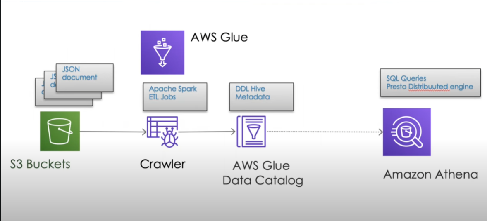

# NBA Data Lake Setup Documentation


## Overview

The NBA Data Lake Setup project automates the process of setting up a data lake for NBA analytics using AWS services. It integrates **Amazon S3**, **AWS Glue**, and **Amazon Athena**, enabling users to fetch, store, and analyze NBA data. The data is fetched from the **SportsData.io API**, uploaded to S3, and processed using Glue and Athena.

## Components

The project uses the following AWS services:
1. **Amazon S3** – For storing raw data and processed data.
2. **AWS Glue** – To create a Glue database and table for querying the NBA data.
3. **Amazon Athena** – For querying the stored data in S3.
4. **SportsData.io API** – Provides NBA data used in the setup.

## Project Workflow

### Flow Diagram

```plaintext
+--------------------+     +-------------------+     +-----------------------+
|   Fetch NBA Data   | --> | Upload Data to S3  | --> | Create Glue Database  |
|  (SportsData.io API)|     |    (S3 Bucket)     |     | and Table             |
+--------------------+     +-------------------+     +-----------------------+
                                                      |
                                                      v
                                         +----------------------------+
                                         | Configure Athena for Querying |
                                         | (Result Output to S3)         |
                                         +----------------------------+


```
# Setup Instructions

## 1. Create a SportsData.io API Key
- Sign up at [SportsData.io](https://sportsdata.io).
- Navigate to the Developers section and get your API key for the NBA.

## 2. Create an S3 Bucket
- Ensure the bucket name is unique, for example: `nba-Mostafa-sports-analytics-data-lake`.
- The bucket will store the raw and processed NBA data.

## 3. Run the Script
- Ensure you have the correct AWS credentials with appropriate permissions for S3, Glue, and Athena.
- Run the script to automate the entire setup.

## 4. Verify the Resources
- **S3 Bucket:** Verify that the data is uploaded to `raw-data/nba_player_data.jsonl`.
- **Glue Database:** Check that the `glue_nba_data_lake` database and `nba_players` table exist.
- **Athena:** Test the Athena query and verify results.

# AWS Permissions Needed

Ensure that your AWS IAM role has the following permissions:

- **S3:** `s3:CreateBucket`, `s3:PutObject`, `s3:ListBucket`
- **Glue:** `glue:CreateDatabase`, `glue:CreateTable`
- **Athena:** `athena:StartQueryExecution`, `athena:GetQueryResults`

# Conclusion

This project automates the creation of a data lake for NBA analytics using AWS S3, Glue, and Athena. It allows easy storage and querying of NBA data, and can be expanded with more analytics and integrations.

# Future Improvements
- Automate data fetching with AWS Lambda.
- Implement data transformation using AWS Glue ETL jobs.
- Visualize data using AWS QuickSight.
